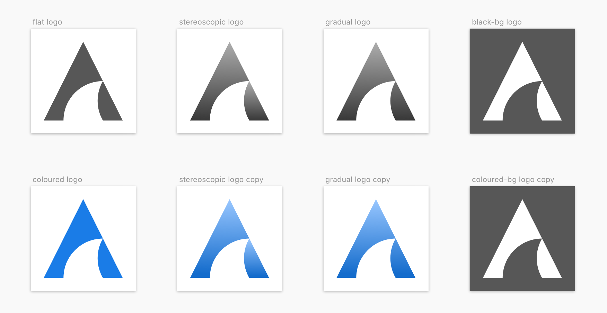
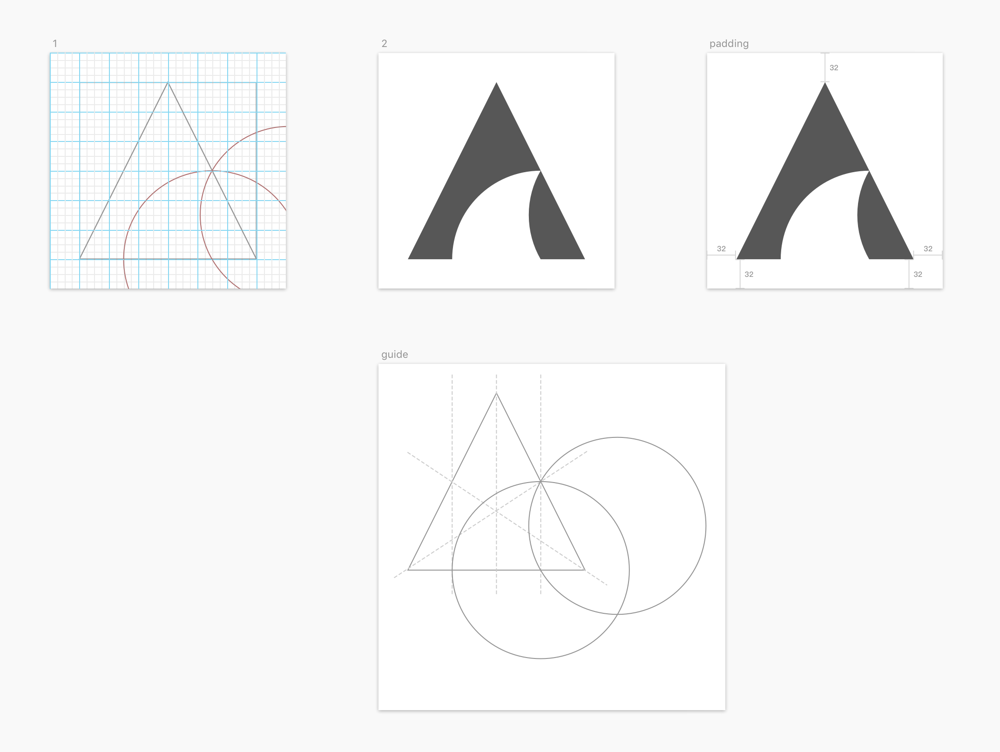

# ADoyle's Logo

[README in English](./README.en.md)

这是一个我自己用的个人 Logo 设计。仅供分享设计思路。

## 预览

## 设计理念

1. 基于我的 ID 首字母 A。
2. 简约，精确，规则。
3. 掀起浪潮。

## 设计过程

1. 选一张尺寸为 8 的倍数，不小于 256*256px 的正方形画板。
2. 画一个正方形，放在中心，取决于正方形和画板的空白边距。
3. 画一个占满正方形内部的等腰三角形，三角形底边等于正方形边长。
4. 画辅助线。
    a. 宽度为 8px 的网格
    b. 三条三角形的中线，两条三角形腰边的中点垂线
5. 画两个圆，直径等于正方形边长。注意圆要同时穿过辅助线的两个交点。具体见下图。
6. 填色

## Copyright and License

Copyright (c) 2019 ADoyle.

ADoyle's Logo 由 <a xmlns:cc="http://creativecommons.org/ns#" href="https://github.com/adoyle-h/my-logo" property="cc:attributionName" rel="cc:attributionURL">ADoyle (adoyle.h@gmail.com)</a> 采用 <a rel="license" href="http://creativecommons.org/licenses/by-nc-nd/4.0/">知识共享 署名-非商业性使用-禁止演绎 4.0 国际 许可协议</a>进行许可。

<!-- Links -->

